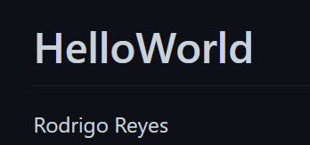

# README

# Rodrigo Reyes A01284917 Carrera ITC
# patricio ruiz a01721996
# Adrian Cantu A01284748



term
: deffinition

### Mi titulo {custom-id}

- item1
- item2
- item3


1. item1
2. item2
3. item3


| Heather | Title |
| Parograph | Text |

```cpp
// Rodrigo Reyes A01284917

#include "Episodio.hpp"
#include <string>


// Metodos Constructores
Episodio::Episodio(){ 
    titulo = "Hacia la Vía Láctea, y más allá ";
    temporada = 1;
    calificacion = 100;
}

Episodio::Episodio(string _titulo, int _temporada, double _calificacion){
    titulo = _titulo;
    temporada = _temporada;
    calificacion = _calificacion;
}

// Metodos Modificadores - cambiar el valor del atributo desde la app
void Episodio::setTitulo(string _titulo){ 
    titulo = _titulo;
}

void Episodio::setTemporada(int _temporada){ 
    temporada = _temporada;
}

void Episodio::setCalificacion(double _calificacion){ 
    calificacion = _calificacion;
}

// Metodos de Acceso - obtener el valor del atributo desde la app
string Episodio::getTitulo(){ 
    return titulo;
}
int Episodio::getTemporada(){ 
    return temporada;
}
double Episodio::getCalificacion(){ 
    return calificacion;
}
    
// Otros Metodos
string Episodio::str(){ 
    return titulo + "," + to_string(temporada) + "," + to_string(calificacion);
}
```
